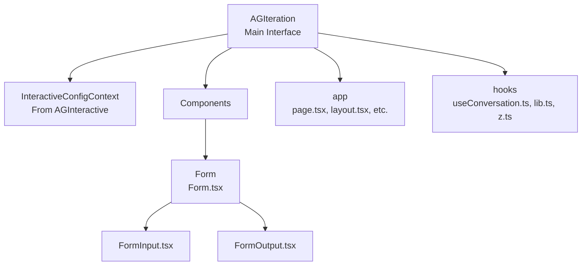

# AGIteration Architecture Reference

This document provides a comprehensive reference of the AGIteration architecture, with a focus on form components, context integration, and configuration. Core functionality is described in detail first, followed by component functionality that builds upon the core patterns.

## System Architecture

AGIteration is a modular React-based framework for form-driven interactions, built with a layered architecture:



### Naming Conventions
- Component Files: PascalCase.tsx (e.g., "Form.tsx")
- Hook Files: camelCase.ts (e.g., "useConversation.ts")
- Utility Files: kebab-case.ts (e.g., "lib.ts")
- Layout Files: kebab-case.tsx (e.g., "layout.tsx")

### Core Design Principles

1. **Form-Based Interaction**: Input/output management through structured forms
2. **Context Reuse**: Leverages InteractiveConfigContext from AGInteractive
3. **Iterative Interaction**: Supports multi-step interactions with follow-up capabilities
4. **Stateful Results**: Maintains history of form submissions and responses
5. **Component Composition**: Modular design with specialized components
6. **TypeScript Integration**: Strong typing for predictable behavior

## Core Functionality

### Form Component (Form.tsx)

The Form component is the main controller for the form-driven interface:

```typescript
export default function Form({
  showChatThemeToggles,
  followUp = false,
}: Overrides & UIProps & { followUp?: boolean }): React.JSX.Element {
  const state = useContext(InteractiveConfigContext);
  const [argValues, setArgValues] = useState({});
  const [uuids, setUUIDs] = useState([]);
  const [uuid, setUUID] = useState('');
  const [loading, setLoading] = useState(false);
  
  // ...
}
```

#### Key Features

1. **State Management**:
   - Manages form values through `argValues` state
   - Tracks submission UUIDs for result history
   - Controls loading states during submissions

2. **Data Fetching**:
   - Uses SWR for data fetching with caching
   - Retrieves prompt arguments from the backend
   - Fetches conversation results based on UUIDs

3. **Form Submission**:
   - Handles text and file submissions
   - Converts files to base64 for transmission
   - Submits to OpenAI through the InteractiveConfigContext

4. **Conditional Rendering**:
   - Shows appropriate components based on state
   - Supports follow-up interactions for multi-step forms
   - Manages loading states visually

### FormInput Component (FormInput.tsx)

The FormInput component renders dynamic form inputs based on arguments:

```typescript
export default function FormInput({
  argValues,
  setArgValues,
  disabled,
}: {
  argValues: Record<string, string>;
  setArgValues: (argValues: Record<string, string> | ((previous: Record<string, string>) => Record<string, string>)) => void;
  disabled: boolean;
}): ReactNode {
  // ...
}
```

#### Key Features

1. **Dynamic Input Generation**:
   - Generates inputs based on argument types
   - Parses argument names for user-friendly labels
   - Supports different input types (currently text)

2. **State Management**:
   - Updates parent state on input changes
   - Properly handles disabled states

3. **Styling**:
   - Uses shadcn/ui components for consistent styling
   - Applies conditional styling for disabled states

### FormOutput Component (FormOutput.tsx)

The FormOutput component displays results with navigation capabilities:

```typescript
export default function FormOutput({
  results,
  showIndex,
  selectedUUID,
  setSelectedUUID,
}: {
  results: string[];
  showIndex: number;
  selectedUUID: string;
  setSelectedUUID: (uuid: string) => void;
}): ReactNode {
  // ...
}
```

#### Key Features

1. **Result Navigation**:
   - Previous/next navigation between results
   - Shows result count and current position
   - Updates selected UUID on navigation

2. **Content Handling**:
   - Renders markdown content
   - Supports copying results to clipboard
   - Displays legal disclaimers for generated content

3. **UI Components**:
   - Uses Card for result display
   - Tooltips for action buttons
   - Responsive design for different screen sizes

## App Structure

### page.tsx
The main page component that renders the AGIteration component:
- Page metadata
- Layout integration
- AGIteration initialization

### layout.tsx
The main layout component that provides the page structure:
- Header
- Main content area
- Footer
- Global styles

### NavMain.tsx
Navigation component that provides the main navigation structure:
- Navigation links
- Active state management
- Mobile responsiveness

### ConvSwitch.tsx
Conversation switch component:
- Enables toggling between conversations
- Quick navigation between recent interactions
- Visual indication of current conversation

## Hooks

### useConversation.ts
Custom hook for conversation management:
```typescript
export function useConversation(conversationId?: string) {
  const { data, error, mutate } = useSWR(
    conversationId ? `/conversation/${conversationId}` : null,
    async () => {
      // fetch conversation data
    }
  );
  
  // Return conversation data and operations
  return {
    conversation: data,
    isLoading: !error && !data,
    isError: error,
    mutate,
    // Additional operations
  };
}
```

#### Key Features
- Loads conversation data using SWR
- Provides loading and error states
- Offers methods for conversation management

### z.ts
Zod schema definitions for type validation:
```typescript
export const FormSchema = z.object({
  name: z.string().min(2).max(50),
  email: z.string().email(),
  // Additional schema definitions
});

export type FormValues = z.infer<typeof FormSchema>;
```

#### Key Features
- Defines validation schemas for form inputs
- Exports TypeScript types from schemas
- Reusable validation logic

### lib.ts
Utility functions for common operations:
```typescript
export function formatDate(date: Date): string {
  return date.toLocaleDateString();
}

export function parseJSON<T>(json: string, fallback: T): T {
  try {
    return JSON.parse(json);
  } catch (error) {
    return fallback;
  }
}
```

#### Key Features
- Common utility functions
- Type-safe operations
- Reusable across components

## Integration with AGInteractive

AGIteration leverages AGInteractive's InteractiveConfigContext for:

1. **Configuration Access**:
   - Accessing agent settings
   - Retrieving mode configuration
   - Using prompt information

2. **SDK Integration**:
   - Accessing the AGInterfaceSDK instance
   - Using the OpenAI client for completions
   - Retrieving conversation data

3. **State Management**:
   - Sharing state between interactive and iteration components
   - Mutating shared state when needed

## Environment Configuration

Key environment variables:
- NEXT_PUBLIC_APP_NAME: Application name for UI display
- NEXT_PUBLIC_API_URI: Backend API URI
- NEXT_PUBLIC_DEFAULT_FORM_AGENT: Default agent for forms
- NEXT_PUBLIC_DEFAULT_FORM_PROMPT: Default prompt for forms
- NEXT_PUBLIC_ENABLE_FORM_FOLLOWUP: Whether to enable follow-up functionality
- NEXT_PUBLIC_SHOW_FORM_TOGGLES: Whether to display theme toggles
